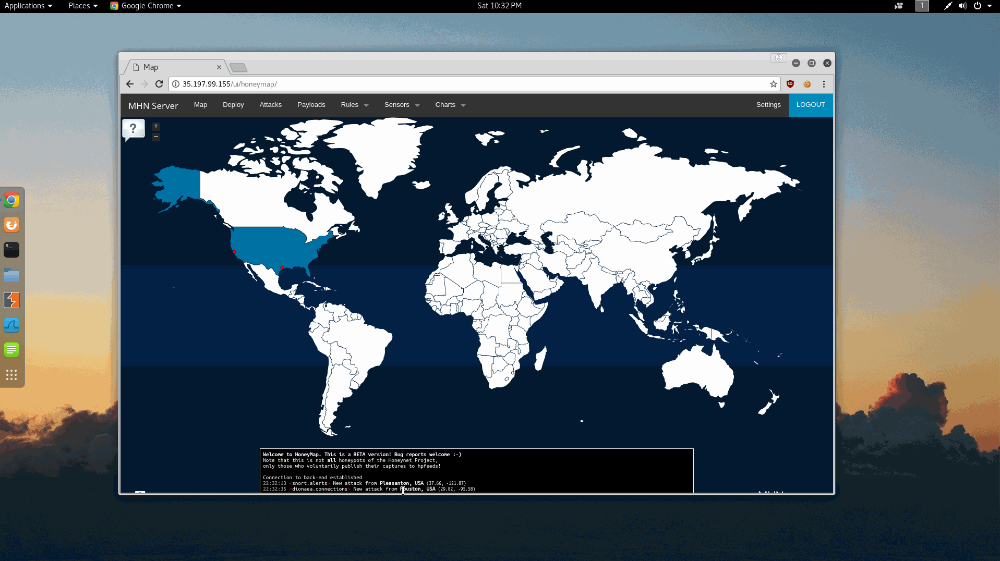

# Project 9 - Honeypot

Time spent: **3** hours spent in total

1. Which Honeypot(s) you deployed
  - Ubuntu - Dionaea with HTTP
  - Ubuntu - Snort
2. Any issues you encountered
  - If you turn off your VM and turn it back on, you might get a new IP. I had to edit the config files to update it.
3. A summary of the data collected: number of attacks, number of malware examples, etc.
  - Ubuntu - Dionaea with HTTP
    - Over 1000 IPs accessing different ports.
	- Location of the IPs are from all around the world.
  - Ubuntu - Snort
	- Over 20 IPs.
    - CINS Found some Active Thereat Inteillegence Poor Reputation IPs
	- SCAN Sipvicious User-Agent Detected (friendly-scanner)
	- DROP Dshield block listed source group
	- VOIP Modified Sipvicious Asterisk PBX User-Agent
	- POLCY suspicious inbound to MSSQL port 1433
4. Any unresolved questions raised by the data collected
  - How to get more information on what they are trying to do besides scanning?
5. GIF
  - GIF Walkthrough: 
